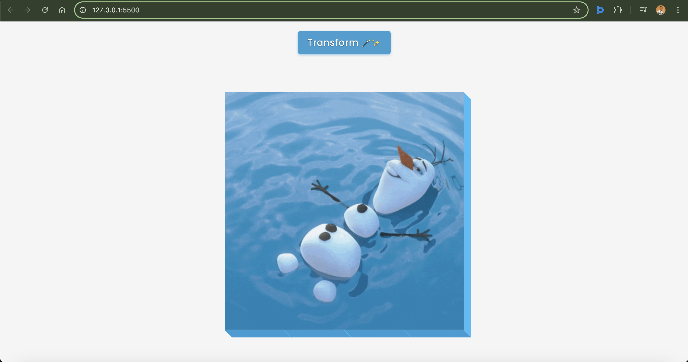

# 3D Boxes with GIF Background



An interactive and visually engaging project that creates a 4x4 grid of 3D boxes with a gif background effect. Built with HTML, CSS, and JavaScript, this project showcases creative animations and transformations, giving the illusion of depth and interactivity. Users can click a button to toggle dynamic transformations of the grid, making this a perfect demonstration of modern web design techniques.

## Key Features
- **3D Box Grid**: A grid of 16 boxes dynamically created with JavaScript, styled with CSS for realistic depth effects.
- **Video/GIF Background**: A looping video/GIF background gives the project a unique and captivating aesthetic.
- **Interactive Transformations**: Click the "Transform" button to toggle a dynamic transformation effect on the grid.
- **Smooth Animations**: Each box features rotation and hover animations for an engaging user experience.
- **Responsive Design**: Works seamlessly across different screen sizes.

## Technologies Used
- **Frontend**: HTML, CSS (with advanced 3D transformations and transitions).
- **JavaScript**: Dynamically generates the grid and handles interactivity.

## How to Run
1. Clone the repository:
   ```bash
   git clone https://github.com/yourusername/3d-boxes-with-vid-bg.git
   cd 3d-boxes-with-vid-bg
   ```
2. Open `index.html` in your browser to experience the 3D grid animation.

## Live Demo
Check out the live [demo](https://chrisroland.github.io/3D-boxes-with-Vid-BG/)

## Contributions
- Feel free to **open issues** if you encounter bugs or have suggestions for improvement.
- **Pull requests** are welcome for new features or enhancements.
- This project is **open-sourced**, and I welcome **constructive feedback** and **collaborations**!

Thank you for checking out this project! ❤️